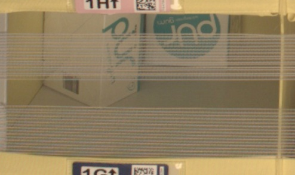
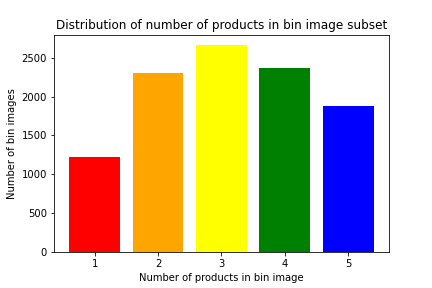
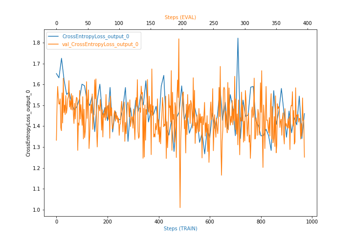

# Inventory Monitoring at Distribution Centers

Inventory monitoring is an essential process at distribution centers. It involves counting inventory objects and ensures that the correct quantities are maintained to meet supply chain demands. There has been a great need to automate the process to meet the growing increase in consumer demand and eliminate errors.

Distribution centers use robots to move objects in bins that can contain multiple objects. Convolutional Neural Networks (CNNs) have achieved excellent results for object detection in images [1-4], text detection [5] vehicle detection [6] and many other applications.

The aims of this project were to:
1. Use machine learning techniques to build a model that can classify the number of objects in each bin to assist in automating the inventory monitoring process [7].
2. Demonstrate a machine learning engineering pipeline.


## Project Set Up and Installation

AWS SageMaker, Amazon S3, Amazon CloudWatch, Jupyter notebook, Python, PyTorch, and various software libraries were used. The necessary libraries were installed with the notebook.

In AWS SageMaker studio, the ml.t3.medium instance was used. It is low cost and has 2 vCPUs and 4 GiB
memory therefore it has sufficient computing power for the project. It also has fast launch.
The ml.g4dn.xlarge instance was used for faster performance to train the models in a container environment
and model deployment. It has 1 GPU, 4 vCPUs and 16 GiB memory therefore it has sufficient computing
power for training. It costs the lowest compared to the other GPU instances [8, 9]. 

<b>Jupyter Notebook</b>

The sagemaker.ipynb notebook was used to:

1. Download the data with the file_list.json file, explore it, and upload it to S3.
2. Define estimators, the tuner, training containers, hyperparameters for hyperparameter tuning, rules and hooks for the debugger and profiler.
3. Perform training jobs and hyperparameter tuning.
4. Display the debugger profiling report and plot a debugger output.
5. Deploy endpoints and make predictions.

<b>Script files</b>

hpo.py was used for hyperparameter tuning. Different hyperparameters were used to train the model to find
the best hyperparameters, which gave the lowest loss for the model.

train.py was used to train the model with the best hyperparameters and perform debugging and profiling.

train_multi.py was used to perform multi-instance GPU model training. with the NVIDIA Collective Communication Library (NCCL) backend, torch.nn.DistributedDataParallel (DDP) and the best hyperparameters.

inference.py was used to deploy the trained model to an endpoint. The image was deserialized, processed
(resized, converted to a tensor, normalized and unsqueezed) and used to make a prediction. 

## Dataset

### Overview

The ABID [10] will be used to classify the number of objects in each bin. It contains over 500 000 JPEG images and the corresponding JSON metadata from bins of a pod in an Amazon Fulfillment Center (AFC).
The bin images are captured as robots transport pods during normal AFC operations [10]. An example
image (777.jpg) [11] and its corresponding metadata [12] are shown below.



```{ "BIN_FCSKU_DATA":
 { "B0067EQF9I":
 { "asin": "B0067EQF9I",
 "height": { "unit": "IN", "value": 2.2 },
 "length": { "unit": "IN", "value": 4.9 },
 "name": "PUR Gum Aspartame Free Wintergreen Gum, 9 Count (Pack of 12)",
 "quantity": 3,
 "weight": { "unit": "pounds", "value": 0.6 },
 "width": { "unit": "IN", "value": 3.8 } } },
 "EXPECTED_QUANTITY": 3,
 "image_fname": "777.jpg"}
```

Due to the large size of the data, a small subset of the data will be used to stay within the allocated budget.
The data subset consists of folders where the name of each folder is equal to the number of objects in each
bin image. For example, in folder 5, each image has 5 objects. The data subset contains 10441 bin images.
The distribution of the number of products per bin in the data subset is shown below. The range of the
number of products is from 1 to 5, therefore there are 5 classes. The most common number of products per
bin is 3.




### Access

Data was obtained from a database and uploaded to Amazon S3 for training the model. The data was
randomly split into training (60%), validation (20%), and testing (20%) sets in the training scripts. 

## Model Selection

The ResNet50 [4] pre-trained PyTorch model [13] was used for the classification task because it has the best accuracy and speed, and a small model size when compared to other models [14] as shown in the Figure below from [14]. ResNet50 consists of 48 convolution layers, 1 max pooling layer and 1 average pooling layer. It has 3.8 billion FLOPs and is extensively used [4, 15]


## Machine Learning Pipeline

The following steps were required to complete the project:
1. Data was obtained from a database and preprocessed.
2. An initial model was trained with fixed hyperparameters to count the number of objects in an image and its accuracy and RMSE were measured.
3. Hyperparameter tuning was performed to find the best hyperparameters to improve the model.
4. A final model was trained with the best hyperparameters to count the number of objects in an image and its accuracy and RMSE were measured.
5. Endpoints were deployed and queried with images to make predictions.
6. Performance of the model was evaluated and validated by comparing it to a benchmark.
7. Multi-instance GPU training was performed. 


## Model Training

The initial model was trained with the hpo.py script with the default hyperparameters shown below.
These hyperparameters are commonly used. 

|Learning rate   |Batch size   |
| :------------: | :-----------: |
| 0.01           | 64          |

The testing performance is shown below.
  
|Loss   |Accuracy   |RMSE   |
| :------------: | :-----------: | :-----------: |
| 99.758           | 16         |  1.432        |
    
    
## Standout Suggestions

### Hyperparameters tuning

Hyperparameters tuning was performed with SageMaker to find the best hyperparameters and refine the
model. The hyperparameter spaces below were used. 


|Learning rate   |Batch size   |
| :------------: | :-----------: |
| 0.001 to 0.1           | [32, 64, 128, 256, 512]          |


The best hyperparameters are shown below and were used to train the final model.


|Learning rate   |Batch size   |
| :------------: | :-----------: |
| 0.00371599290323504           | 32         |


### Final model

The testing performance is shown below. The final model's loss and RMSE improved but the accuracy decreased as compared to the initial model's performance.
  
|Loss   |Accuracy   |RMSE   |
| :------------: | :-----------: | :-----------: |
| 45.059           | 10         | 0.866        |

SageMaker debugger and profiler were used to train the final model. The debugger profiling report
recommended the following:

LowGPUUtilization and Batch size rules:
Use a smaller instance type or increase the batch size because the training job underutilized the instance. 

### Model Deployment

An endpoint was deployed with the final model. The inference.py script was used.

The image was deserialized in the input_fn function.

<code>if content_type == JPEG_CONTENT_TYPE: 
    return Image.open(io.BytesIO(request_body))
    
if content_type == JSON_CONTENT_TYPE:
    request = json.loads(request_body)  
    url = request['url']
    img_content = requests.get(url).content
    return Image.open(io.BytesIO(img_content))    
</code>

The image was processed in the predict_fn function. It was resized, converted to a tensor, normalized and unsqueezed) and used to make a prediction. 

<code>test_transform = transforms.Compose([
    transforms.Resize((224, 224)),
    transforms.ToTensor(),
    transforms.Normalize(mean=[0.485, 0.456, 0.406], std=[0.229, 0.224, 0.225])
    ])  

normalized=test_transform(input_object)
batchified = normalized.unsqueeze(0)
input1 = batchified.to(device)
    
with torch.no_grad():
    prediction = model(input1)
    return prediction
</code>


The endpoint was queried with images 923.jpg [16] and 777.jpg [11] to make predictions. In the sagemaker.ipynb notebook, the code below was used.

<code>import requests

request_dict={ "url": "https://aft-vbi-pds.s3.amazonaws.com/bin-images/923.jpg" }
img_bytes = requests.get(request_dict['url']).content
response=predictor.predict(img_bytes, initial_args={"ContentType": "image/jpeg"})
</code>

Image 923.jpg is shown below from [16]. Its corresponding metadata [17] has an expected quantity=4. 


The results for image 923.jpg are shown below. The maximum is in bold (index=2). The model could not predict the correct result (index=3).
 
<code>[-1.8109267950057983,
0.2871607542037964,
<b>0.66116863489151</b>,
0.5736399292945862,
0.3940010368824005]
</code>


The results for image 777.jpg [11] are shown below. Its corresponding metadata [12] has an expected quantity=3 but it looks like there are 2 objects in the image, 1 could be occluded. 

<code>[<b>2.741820812225342</b>,
1.6072783470153809,
-0.2160869836807251,
-2.114128589630127,
-3.8471338748931885]
</code>

The maximum is in bold (index=0). The model could not predict the correct result (index=2). If the number
of objects is taken as 2 (index=1), the result would be also be incorrect.

The final model needs further improvement as it does not produce the correct results. This is discussed in the Improvement section.

### Multi-Instance Training

Multi-Instance GPU model training was performed with the train_multi.py script. The NCCL backend,
DDP and the best hyperparameters were used. Two instances of ml.g4dn.xlarge were used to save costs. 

## Justification

The performance for the benchmark [22] and final model is compared below.

|   |Benchmark   |Final model   |
| :------------: | :-----------: | :-----------: |
| Accuracy           | 55.67         | 10        |
| RMSE          | 0.930         | 0.866        |

The final model has lower accuracy and RMSE compared to the benchmark. The pipeline to build the model
follows the standard procedure [18]. However, the model is unable to accurately classify the number of
objects in an image therefore it needs further improvement. 


## Conclusion
### Free-Form Visualization



The Cross - entropy loss is shown above. It is difficult to determine if the model is learning because
of the numerous oscillations. These are likely due to the small batch size [19] or outliers [20]. If a larger
batch size is used and the outliers are removed, the training curve may smooth out, and show a decrease in
loss, which indicates the model is learning. This maybe the case, as the training loss decreases from about
1.65 to 1.45, and the cross validation loss decreases from about 1.33 to 1.25.

### Improvement
Low quality images such as images with occlusions, unclear or blurry images and images where the contents
of the bin images do not match the inventory record, could be removed to improve performance. This
would have been very time - consuming if performed manually. An automated method would be better.
Training on a larger dataset may improve performance. Tuning with more training jobs may result in better
hyperparameters. Large batch sizes may prevent oscillations. The network architecture that was added onto
the pre-trained model for fine-tuning could be modified. The number of input and output features, in the
fully connected layers and the number of layers could be modified. Alternative pre-trained models such as
EfficientNet, Inception and VGG [21] could be tried.

## References

[1] Redmon, J. & Farhadi, A. 2018. YOLOv3: An incremental improvement. arXiv preprint, arXiv1804.02767.

[2] Fu, C-Y., Liu, W., Ranga, A., Tyagi, A. & Berg, A.C. 2017. DSSD: Deconvolutional single shot detector. arXiv preprint,
arXiv:1701.06659.

[3] https://github.com/ultralytics/yolov5, Accessed 18/1/22.

[4] He, K., Zhang, X., Ren, S. and Sun, J., 2016. Deep residual learning for image recognition. In Proceedings of the IEEE
conference on computer vision and pattern recognition, pp. 770-778.

[5] He, T., Huang, W., Qiao, Y. and Yao, J., 2016. Text-attentional convolutional neural network for scene text detection. IEEE
transactions on image processing, 25(6), pp.2529-2541

[6] Chen, X., Xiang, S., Liu, C.L. and Pan, C.H., 2014. Vehicle detection in satellite images by hybrid deep convolutional neural
networks. IEEE Geoscience and remote sensing letters, 11(10), pp.1797-1801.

[7] https://classroom.udacity.com/nanodegrees/nd189/parts/cd0549/modules/864d3e12-dc8d-47c6-b443-
d01d6c7aedde/lessons/d6ec6005-e421-455c-9b79-ebc2df44e1ac/concepts/ad3d3503-f9a9-4c18-86ae-c03d6fbb1470, Accessed
18/1/22. 

[8] https://aws.amazon.com/SageMaker/pricing/, Accessed 19/2/22.

[9] https://docs.aws.amazon.com/SageMaker/latest/dg/notebooks-available-instance-types.html, Accessed 19/2/22

[10] https://registry.opendata.aws/amazon-bin-imagery/, Accessed 18/1/22.

[11] https://aft-vbi-pds.s3.amazonaws.com/bin-images/777.jpg, Accessed 22/1/22. 

[12] https://aft-vbi-pds.s3.amazonaws.com/metadata/777.json, Accessed 22/1/22.

[13] https://pytorch.org/vision/stable/models.html, Accessed 19/2/22.

[14] https://learnopencv.com/pytorch-for-beginners-image-classification-using-pre-trained-models/, Accessed 19/2/22.

[15] https://www.google.com/amp/s/iq.opengenus.org/resnet50-architecture/amp/, Accessed 19/2/22.

[16] https://aft-vbi-pds.s3.amazonaws.com/bin-images/923.jpg, Accessed 19/2/22.

[17] https://aft-vbi-pds.s3.amazonaws.com/metadata/923.json, Accessed 19/2/22.

[18] https://classroom.udacity.com/nanodegrees/nd189/parts/cd0387/modules/44f321a8-8d42-43a6-a682-
9d3b6b0e5bc5/lessons/a822f040-5481-4d51-8e34-950ee5e76ae9/concepts/0aff4cec-3ada-489f-8ea6-df74decfde1e, Accessed
19/2/22.

[19] https://stackoverflow.com/questions/68529287/why-does-my-learning-curves-shows-spikes-or-fluctuations, Accessed
10/1/22.

[20] https://stats.stackexchange.com/questions/303857/explanation-of-spikes-in-training-loss-vs-iterations-with-adam-optimizer,
Accessed 10/1/22.

[21] https://towardsdatascience.com/4-pre-trained-cnn-models-to-use-for-computer-vision-with-transfer-learning-885cb1b2dfc,
Accessed 19/2/22.

[22] https://github.com/silverbottlep/abid_challenge, Accessed 18/1/22. 
